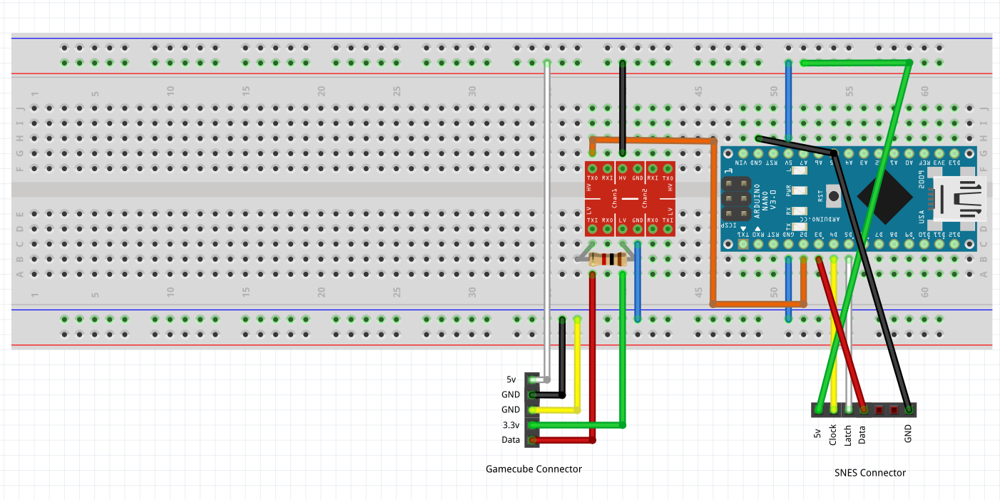

# SNES to GameCube adapter

Code for building a SNES to GameCube controller adapter.
Also works with the 8Bitdo [SN30 2.4g wireless gamepad](https://www.8bitdo.com/sn30-wireless-for-original-snes-sfc/)
And the 8Bitdo [Retro Receiver](https://www.8bitdo.com/retro-receiver-snes/)

## Software Requirements
- [Arduino IDE](https://www.arduino.cc/en/Main/Software) (tested on 1.8.19)
- [Arduino Nintendo Library](https://github.com/NicoHood/Nintendo) by NicoHood

## Hardware

### Parts
- Logic Level Converter 5v <-> 3.3v
- Arduino Nano (5v 16MHz)
- USB -> Serial adapter if your Arduino comes without USB.
- 1kΩ Resistor
- Female SNES controller port (SNES extension cable)
- Male GameCube controller connector (GameCube extension cable)

### Wiring

The colors of the wires in the cables may not match between the original controller and the extension cable, below is the mapping for my cables, the colors may be different for you. 
Be aware that some GameCube extension cables have 2 ground wires instead of 3

#### SNES pinout
Type	| Original Controller  | Extension Cable
--------|-----------|----------------
5v		| white 	| green
clock	| yellow 	| yellow
latch	| orange 	| white
data	| red 		| red
gnd		| brown 	| black

#### GameCube Pinout
Type	| Original Controller 	| Extension Cable
--------|-----------|----------------
5v		| yellow 	| white
3.3v		| blue 	| green
data		| red 	| red
gnd	| black 		| black
gnd		| white 	| yellow
gnd	| green 		| blue 
